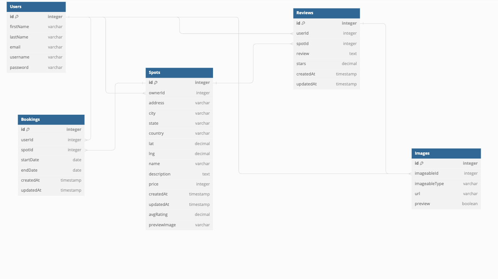

// Use DBML to define your database structure
// Docs: https://dbml.dbdiagram.io/docs

Table Users {
  id integer [pk, increment]
  firstName varchar
  lastName varchar
  email varchar [unique]
  username varchar [unique]
  password varchar

}

Table Spots {
  id integer [pk, increment]
  ownerId integer [ref: > Users.id]
  address varchar
  city varchar
  state varchar
  country varchar
  lat decimal
  lng decimal
  name varchar
  description text
  price integer
  createdAt timestamp
  updatedAt timestamp
  avgRating decimal
  previewImage varchar
}

Table Images {
  id integer [pk, increment]
  imageableId integer [ref: > Users.id, ref: > Reviews.id]
  imageableType varchar
  url varchar
  preview boolean
}

Table Reviews {
  id integer [pk, increment]
  userId integer [ref: > Users.id]
  spotId integer [ref: > Spots.id]
  review text
  stars decimal
  createdAt timestamp
  updatedAt timestamp
}

Table Bookings {
  id integer [pk, increment]
  userId integer [ref: > Users.id]
  spotId integer [ref: > Spots.id]
  startDate date
  endDate date
  createdAt timestamp
  updatedAt timestamp
}

